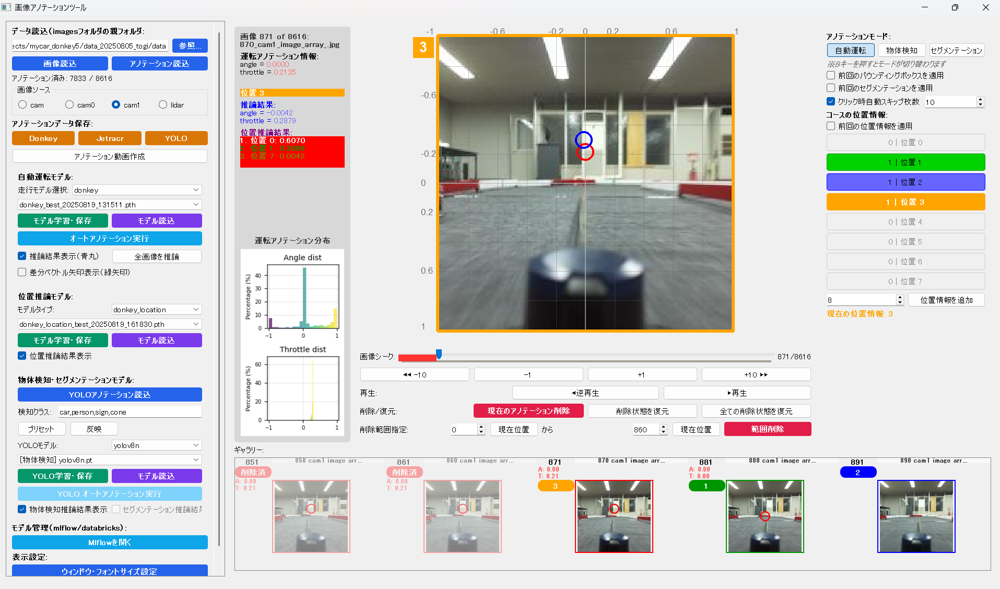

# AIミニカーアノテーションツール



このツールは、自動運転と物体検知データセットのためのアノテーションを作成・管理するためのグラフィカルインターフェースを提供します。DonkeycarやJetracerなどのAIミニカー向けに設計されており、直感的なGUIで効率的なデータセット作成が可能です。

## 🏎️ 対応AIミニカープラットフォーム

### Donkeycar


**Donkeycar**は、オープンソースの自律運転ミニカープラットフォームです。Raspberry Piをベースとし、機械学習を使った自動運転の実験・学習に最適です。

- **公式リポジトリ**: [https://github.com/autorope/donkeycar](https://github.com/autorope/donkeycar)
- **公式ドキュメント**: [https://docs.donkeycar.com/](https://docs.donkeycar.com/)
- **特徴**: RCカーベース、コミュニティ豊富、豊富なパーツオプション
- **データ形式**: JSON Lines形式でのカタログファイル

### Jetracer


**Jetracer**は、NVIDIA Jetson Nanoを使用した教育向け自律運転ロボットです。リアルタイム深層学習推論に特化した設計で、高性能な画像処理が可能です。

- **公式リポジトリ**: [https://github.com/NVIDIA-AI-IOT/jetracer](https://github.com/NVIDIA-AI-IOT/jetracer)
- **開発元**: NVIDIA AI-IOT
- **特徴**: Jetson Nano搭載、GPU加速、教育向け設計
- **データ形式**: ファイル名に座標情報を埋め込む形式

本ツールは両プラットフォームのデータ形式に対応し、相互変換も可能です。

## 🚀 クイックスタート

### 3分で始める基本的な使い方

1. **起動**
   ```bash
   python main.py
   ```

2. **画像読み込み**
   - 左パネル「データ読込」→「参照...」
   - 画像フォルダの**親フォルダ**を選択
   - 「画像を読込」をクリック

3. **アノテーション作成**
   - **運転データ**: 画像上をクリック（赤い点で角度・スロットル値が自動計算）
   - **物体検知**: 「B」キーでモード切替 → マウスドラッグでバウンディングボックス描画
   - **位置情報**: 右パネルの数字ボタン（0-7）をクリック

4. **データ保存**
   - 「Donkey」「YOLO」「Jetracer」ボタンでそれぞれの形式にエクスポート

## 🖥️ インターフェース概要

上記のスクリーンショットで示されるインターフェースは以下の要素で構成されています：

### 左パネル（設定・操作パネル）
- **データ読込エリア**: 画像フォルダ選択、アノテーション読み込み
- **アノテーション設定**: クリック後自動スキップ、スキップ枚数設定
- **モード表示**: 現在のアノテーションモード（自動運転/物体検知）
- **推論設定**: 学習済みモデルによる推論表示ON/OFF
- **YOLOモデル設定**: 物体検知・セグメンテーション用モデル選択

### 中央エリア（メインビューワー）
- **画像表示**: 現在選択中の画像とアノテーション結果
- **ステアリング・スロットル表示**: 画像下部の操作値表示
- **統計グラフ**: アノテーション分布の可視化
- **進捗情報**: 現在の画像番号/総画像数

### 右パネル（位置・エクスポートパネル）
- **位置情報ボタン**: 0-7の位置タグ設定（各ボタンにアノテーション数表示）
- **エクスポートボタン**: Donkey、YOLO、Jetracerの各形式での保存
- **モデル学習**: 学習・保存ボタン

### 下部（ギャラリービュー）
- **サムネイル一覧**: 全画像のサムネイル表示
- **カラーコード**: 各画像のアノテーション状態を色で表示
  - 🔴 赤: 位置0のアノテーション
  - 🟢 緑: 位置1のアノテーション  
  - 🔵 青: アノテーションなし
  - その他の色: 各位置情報に対応

## ⚡ 基本操作

### 🎯 アノテーション作成の基本
| 操作 | 方法 | 結果 |
|------|------|------|
| 運転データ作成 | 画像上をクリック | 赤い点で角度・スロットル値を記録 |
| 物体検知 | 「B」キー → マウスドラッグ | バウンディングボックス描画 |
| 位置タグ付け | 右パネルの数字ボタン（0-7） | 現在画像に位置IDを割当て |
| アノテーション削除 | 「Delete」キー | 現在のアノテーションを削除 |

### ⌨️ 便利なキーボードショートカット
| キー | 機能 |
|------|------|
| `←` `→` | 前後の画像に移動（スキップ設定に連動） |
| `B` | アノテーションモード切替 |
| `Space` | 自動再生/停止 |
| `0-7` | 位置情報設定/解除 |
| `Delete` | アノテーション削除 |

## 主な機能

このツールは以下のことが可能です：

1. 画像データセットの読み込み
2. 運転アノテーション（ステアリング角度とスロットル）の作成
3. 物体検知アノテーション（バウンディングボックス・セグメンテーション）の作成
4. 画像への位置情報の割り当て
5. モデルのトレーニングと評価
6. 様々な形式でのアノテーションのエクスポート

## 機能

### アノテーション機能
- **運転制御**: ステアリング角度とスロットルのアノテーション
- **物体検知**: オブジェクト（車、人、標識、コーンなど）のバウンディングボックス作成
- **位置タグ付け**: 画像に位置識別子を割り当て
- **バッチ操作**: 自動アノテーション、範囲削除など

### トレーニングと推論
- **モデルトレーニング**: 運転制御用のニューラルネットワークをトレーニング
- **Speed出力**: 速度（speed）を追加出力として学習可能
- **将来予測出力**: 5フレーム先・10フレーム先のangle/throttle/speedを予測するモデルを学習可能
- **YOLO統合**: 物体検知用のYOLOモデルのトレーニングと使用
- **データ拡張**: 拡張によるトレーニングデータの強化
- **推論プレビュー**: 画像上でのモデル予測の表示（将来予測も含む）

### エクスポートオプション
- **Donkeycar形式**: Donkeycar用のアノテーションをエクスポート
- **Jetracer形式**: Jetracer用のアノテーションをエクスポート
- **YOLO形式**: YOLO用のアノテーションをエクスポート
- **アノテーション動画**: アノテーションを可視化した動画の作成

### Grad-CAM（モデル判断根拠の可視化）
- **GradCAM表示**: 自動運転モデルがどの画像領域に注目して判断しているかをヒートマップで可視化
- **複数CAM手法**: 以下の可視化手法から選択可能

| 手法 | 特徴 | 速度 | 用途 |
|------|------|------|------|
| `GradCAM` | 最終層の勾配を使用した標準手法 | 高速 | 一般的な可視化、まずはこれを試す |
| `GradCAM++` | 重み付けを改良、複数オブジェクトに強い | 高速 | 画像内に複数の注目領域がある場合 |
| `EigenCAM` | 主成分分析で特徴を抽出、勾配不使用 | 高速 | 勾配が不安定な場合の代替手法 |
| `LayerCAM` | 各レイヤーの寄与を個別に計算 | 高速 | より細かい空間解像度が必要な場合 |
| `ScoreCAM` | マスクベースで勾配不使用、高精度 | 低速 | 最も正確な可視化が必要な場合 |

- **対象出力選択**: angle、throttle、speedそれぞれの判断根拠を個別に可視化
- **勾配方向選択**: 正負両方の寄与を同時に可視化可能

| 方向 | 表示内容 | カラー |
|------|---------|--------|
| `both` | 正負両方の寄与を同時表示 | 赤=正、青=負 |
| `positive` | 出力を増加させる寄与のみ | JETカラーマップ |
| `negative` | 出力を減少させる寄与のみ | JETカラーマップ |

  - **bothモードの色の意味**:
    - angle: 赤=右に切る根拠、青=左に切る根拠
    - throttle: 赤=加速の根拠、青=減速の根拠

- **ViT系モデル対応**: MobileViT、Swin Transformer、EfficientFormer等のTransformerベースモデルにも正しく対応

### 高度な機能
- **実験追跡**: モデルパフォーマンス追跡のためのMLflow統合
- **セッション管理**: アノテーションセッションの保存と復元
- **拡張プレビュー**: トレーニング前に拡張効果を確認

### クラウド連携
- **Google Colab連携**: アノテーションデータをGoogle Driveに転送し、Colabで学習を実行
  - 詳細は [README_COLAB.md](README_COLAB.md) を参照
- **Databricks連携**: アノテーションデータをDatabricksに転送し、クラスタで学習を実行
  - 詳細は [README_DATABRICKS.md](README_DATABRICKS.md) を参照

## 要件

- Python 3.7以上
- PyQt5
- PyTorch
- Pillow
- NumPy
- MLflow
- Ultralytics
- pytorch-grad-cam（Grad-CAM可視化機能用）

詳細なバージョン要件については、requirements.txtを参照してください。

## インストール

### 前提条件
- **Windows**: Python 3.11（Donkeycarとの互換性を考慮）
- **Ubuntu / JetPack 6.2**: Python 3.10
- Git
- GPU利用時: NVIDIA GPU + CUDAドライバ

---

### Ubuntu 22.04（PC）での環境構築

#### 1. システム依存パッケージのインストール

```bash
# システムを更新
sudo apt update && sudo apt upgrade -y

# Python関連パッケージ
sudo apt install -y python3.10 python3.10-venv python3.10-dev python3-pip

# PyQt5依存ライブラリ
sudo apt install -y libxcb-xinerama0 libxcb-cursor0 libxkbcommon-x11-0 \
    libxcb-icccm4 libxcb-image0 libxcb-keysyms1 libxcb-randr0 \
    libxcb-render-util0 libxcb-shape0

# OpenCV依存ライブラリ
sudo apt install -y libgl1-mesa-glx libglib2.0-0

# (オプション) GPU利用時 - NVIDIA CUDAドライバ
# https://developer.nvidia.com/cuda-downloads からインストール
```

#### 2. リポジトリのクローン

```bash
git clone https://github.com/Romihi/annotation_training_d2j.git
cd annotation_training_d2j
```

#### 3. 仮想環境の作成と有効化

```bash
# 仮想環境を作成
python3.10 -m venv venv

# 仮想環境を有効化
source venv/bin/activate

# pipのアップグレード
pip install --upgrade pip
```

#### 4. 依存パッケージのインストール

**CPU版（GPUなし）:**
```bash
pip install torch torchvision --index-url https://download.pytorch.org/whl/cpu
pip install -r requirements.txt
```

**GPU版（CUDA 11.8）:**
```bash
pip install torch torchvision --index-url https://download.pytorch.org/whl/cu118
pip install -r requirements.txt
```

**GPU版（CUDA 12.1）:**
```bash
pip install torch torchvision --index-url https://download.pytorch.org/whl/cu121
pip install -r requirements.txt
```

#### 5. 起動

```bash
python main.py
```

#### 6. 仮想環境の終了

```bash
deactivate
```

---

### JetPack 6.2（Jetson Orin）での環境構築

JetsonのARM64環境では、以下のパッケージはシステムパッケージを使用します:
- PyQt5, NumPy, OpenCV, Matplotlib（aptでインストール）
- PyTorch（JetPack付属）

requirements.txtの環境マーカーにより、これらは自動的にスキップされます。

#### 1. システム依存パッケージのインストール

```bash
# システムを更新
sudo apt update && sudo apt upgrade -y

# Python関連パッケージ
sudo apt install -y python3.10-venv python3.10-dev python3-pip

# ARM64ではpipでインストールできないパッケージをaptでインストール
sudo apt install -y python3-pyqt5 python3-numpy python3-opencv python3-matplotlib

# PyQt5依存ライブラリ
sudo apt install -y libxcb-xinerama0 libxcb-cursor0 libxkbcommon-x11-0 \
    libxcb-icccm4 libxcb-image0 libxcb-keysyms1 libxcb-randr0 \
    libxcb-render-util0 libxcb-shape0

# OpenCV依存ライブラリ
sudo apt install -y libgl1-mesa-glx libglib2.0-0
```

#### 2. リポジトリのクローン

```bash
git clone https://github.com/Romihi/annotation_training_d2j.git
cd annotation_training_d2j
```

#### 3. 仮想環境の作成と有効化

```bash
# 仮想環境を作成（システムパッケージを継承）
python3.10 -m venv venv --system-site-packages

# 仮想環境を有効化
source venv/bin/activate

# pipのアップグレード
pip install --upgrade pip
```

#### 4. 依存パッケージのインストール

```bash
# 依存パッケージをインストール
pip install -r requirements.txt

# 依存関係で再インストールされたパッケージを削除（システムパッケージを使用）
pip uninstall -y numpy opencv-python
```

> **注意**: ultralytics等の依存関係でnumpyとopencv-pythonが自動インストールされますが、
> システムのmatplotlibと互換性がないため削除が必要です。

#### 5. 起動

```bash
python main.py
```

#### 6. 仮想環境の終了

```bash
deactivate
```

---

### Windows での環境構築

#### 1. Pythonのインストール

1. [Python公式サイト](https://www.python.org/downloads/)からPython 3.11をダウンロード
2. インストール時に「Add Python to PATH」にチェックを入れる
3. コマンドプロンプトで確認:
   ```cmd
   python --version
   ```

#### 2. リポジトリのクローン

```cmd
git clone https://github.com/Romihi/annotation_training_d2j.git
cd annotation_training_d2j
```

#### 3. 仮想環境の作成と有効化

```cmd
# 仮想環境を作成
python -m venv venv

# 仮想環境を有効化
venv\Scripts\activate
```

#### 4. 依存パッケージのインストール

**CPU版（GPUなし）:**
```cmd
pip install torch torchvision --index-url https://download.pytorch.org/whl/cpu
pip install -r requirements.txt
```

**GPU版（CUDA 11.8）:**
```cmd
pip install torch torchvision --index-url https://download.pytorch.org/whl/cu118
pip install -r requirements.txt
```

**GPU版（CUDA 12.1）:**
```cmd
pip install torch torchvision --index-url https://download.pytorch.org/whl/cu121
pip install -r requirements.txt
```

**RTX 50シリーズ（CUDA 12.8 Nightly）:**
```cmd
pip install --pre torch torchvision --index-url https://download.pytorch.org/whl/nightly/cu128
pip install -r requirements.txt
```

#### 5. 起動

```cmd
python main.py
```

#### 6. 仮想環境の終了

```cmd
deactivate
```

---

### GPU動作確認

Pythonで以下を実行してGPUが認識されているか確認:

```python
import torch
print(f"PyTorch version: {torch.__version__}")
print(f"CUDA available: {torch.cuda.is_available()}")
if torch.cuda.is_available():
    print(f"CUDA version: {torch.version.cuda}")
    print(f"GPU: {torch.cuda.get_device_name(0)}")
```

---

### トラブルシューティング（環境構築）

**Ubuntu: PyQt5がクラッシュする**
```bash
# XCB関連ライブラリを追加インストール
sudo apt install -y libxcb-xinerama0 libxcb-cursor0
export QT_QPA_PLATFORM=xcb
```

**Windows: DLLエラーが発生する**
- [Microsoft Visual C++ 再頒布可能パッケージ](https://aka.ms/vs/17/release/vc_redist.x64.exe) をインストール

**GPU が認識されない**
1. NVIDIAドライバが最新か確認: `nvidia-smi`
2. PyTorchのCUDAバージョンがドライバと一致しているか確認
3. 仮想環境内でPyTorchを再インストール

**pip install が遅い/失敗する**
```bash
# ミラーを使用
pip install -r requirements.txt -i https://pypi.org/simple/
```

## 操作説明

### 初回起動から学習完了までの詳細手順

#### 1. 準備とツールの起動

1. **事前準備**
   - 走行データ（画像）を含むフォルダを用意します
   - フォルダ構造例：
     ```
     your_data_folder/
     └── images/
         ├── 0_abcd123_image_array_.jpg
         ├── 1_abcd124_image_array_.jpg
         └── ...
     ```

2. **ツールの起動**
   ```bash
   python main.py
   ```

#### 2. 画像データの読み込み

1. **フォルダの選択**
   - 左パネルの「データ読込」セクションで「参照...」ボタンをクリック
   - `images`フォルダの**親フォルダ**を選択（重要：imagesフォルダ自体ではなく、その上のフォルダを選択）
   - 複数フォルダの場合：Ctrlキーを押しながら複数選択可能

2. **画像の読み込み**
   - 「画像を読込」ボタンをクリック
   - 読み込み成功すると：
     - 中央に最初の画像が表示されます
     - 下部にサムネイルギャラリーが表示されます
     - 左パネルに統計情報（総画像数など）が表示されます

3. **既存アノテーションの読み込み（オプション）**
   - 以前のアノテーションがある場合：「アノテーションデータを読込」ボタンをクリック
   - 自動的に同階層のcatalogファイルを検索して読み込みます

#### 3. アノテーションの作成

##### A. 自動運転アノテーション（ステアリング・スロットル）

1. **モードの確認**
   - 左下の「Annotation Mode」が「自動運転モード」になっていることを確認
   - 違う場合は「Bキー」で切り替え

2. **アノテーション方法**
   - 画像上の任意の点をクリック
   - クリック位置に基づいて自動的に値が計算されます：
     - 横軸（X）：ステアリング角度（-1.0〜1.0）
     - 縦軸（Y）：スロットル値（-1.0〜1.0）
   - 赤い点が表示され、アノテーションが記録されます

3. **効率的な作業のコツ**
   - 「設定」→「アノテーション設定」で「クリック後自動次へ」にチェックを入れると自動的に次の画像に移動
   - スキップ枚数を設定して、一定間隔でアノテーション可能

##### B. 物体検知アノテーション（バウンディングボックス）

1. **モードの切り替え**
   - 「Bキー」を押して「物体検知モード」に切り替え
   - または左パネルでクラス設定を行うと自動的に切り替わります

2. **クラスの設定**
   - 「検知クラス設定」で検知したいクラスを入力
   - 例：`car,person,sign,cone`（カンマ区切り）
   - 「プリセット」ボタンで一般的なクラスセットを選択可能

3. **バウンディングボックスの描画**
   - マウスでドラッグして矩形を描画
   - リリース時にクラス選択ダイアログが表示
   - クラスを選択して確定

4. **編集操作**
   - 選択：既存のボックスをクリック
   - 移動：選択したボックスをドラッグ
   - リサイズ：ボックスの角をドラッグ
   - 削除：選択してDeleteキー

##### C. 位置情報アノテーション

1. **位置ボタンの使用**
   - 右パネルの数字ボタン（0-7）をクリック
   - 現在の画像に位置IDが割り当てられます
   - コース上の特定の場所を識別するのに使用

#### 4. データの保存とエクスポート

1. **Donkeycar形式でエクスポート**
   - 「Donkey」ボタンをクリック
   - 保存先フォルダを選択
   - catalog.jsonとmyconfig.pyが生成されます

2. **YOLO形式でエクスポート**（物体検知の場合）
   - 「YOLO」ボタンをクリック
   - タスクタイプ（検知/セグメンテーション）を選択
   - train/valの分割比率を設定（デフォルト80:20）

3. **Jetracer形式でエクスポート**
   - 「Jetracer」ボタンをクリック
   - 位置情報付きのデータセットが生成されます

#### 5. モデルの学習

##### A. 自動運転モデルの学習

1. **モデル選択**
   - 「走行モデル選択」ドロップダウンからモデルを選択
   - 推奨：始めは学習も早く軽量な「donkeycar(全7層のCNN)」、精度重視なら「resnet18」等

2. **学習設定**
   - 「モデル学習・保存」ボタンをクリック
   - 学習パラメータを設定：
     - エポック数：30（デフォルト）
     - バッチサイズ：16
     - 学習率：0.001
     - Early Stopping：有効（推奨）

3. **出力設定（Speed・将来予測）**
   - **Speed出力を含める**: 速度（speed）を3つ目の出力として追加
     - アノテーションにspeed値が含まれている場合に有効
     - 出力形式: `[angle, throttle, speed]`
   - **将来フレームの予測を出力に追加**: 5フレーム先・10フレーム先の値を予測
     - Speed無し（6出力）: `[angle, throttle, t+5_angle, t+5_throttle, t+10_angle, t+10_throttle]`
     - Speed有り（9出力）: `[angle, throttle, speed, t+5_angle, t+5_throttle, t+5_speed, t+10_angle, t+10_throttle, t+10_speed]`
     - 将来予測により、先読み制御が可能なモデルを学習できます

4. **データ拡張設定**
   - 「データオーグメンテーションを有効にする」にチェック
   - 各種拡張パラメータを調整（プレビュー機能で確認可能）

5. **学習開始**
   - 「学習開始」ボタンをクリック
   - プログレスバーで進捗を確認
   - 将来予測有効時は、t+5/t+10の損失も個別に表示されます
   - 完了後、modelsフォルダに保存されます

##### B. YOLOモデルの学習（物体検知）

1. **YOLOモデル選択**
   - YOLOモデルタイプを選択（yolov8n推奨）
   - タスクに応じて適切なモデルを選択

2. **学習設定**
   - 「YOLO学習」ボタンをクリック
   - パラメータ設定：
     - エポック数：30-50
     - 画像サイズ：640（デフォルト）
     - バッチサイズ：GPUメモリに応じて調整

3. **学習実行**
   - データセットの準備が自動的に行われます
   - 学習中はリアルタイムで損失値が表示されます

#### 6. 学習済みモデルの使用

1. **モデルの読み込み**
   - 「モデル読込」ボタンをクリック
   - modelsフォルダから学習済みモデルを選択
   - モデルの出力数（2/3/6/9出力）は自動的に検出されます

2. **推論の実行**
   - 「推論結果表示」にチェック
   - 画像を切り替えると自動的に推論が実行されます
   - 青い点（自動運転）または緑の枠（物体検知）で結果が表示

3. **推論結果の表示（Speed・将来予測）**
   - **Speed**: Speedバー上にシアン色の横線で表示
   - **将来予測**:
     - t+5: 明るいシアン色の丸（サイズ22）
     - t+10: 暗いシアン色の丸（サイズ14）
     - Speedバーにも将来予測の横線が表示されます
   - 「将来アノテーション表示」チェックボックスで表示/非表示を切り替え可能

4. **バッチ推論**
   - 「全画像を推論」ボタンで一括推論
   - 結果はCSVファイルにエクスポート可能

5. **Grad-CAM（判断根拠の可視化）**
   - モデルを読み込んだ状態で「GradCAM表示」チェックボックスをON
   - **対象出力選択**: angle、throttle、speedから選択して個別に確認
   - **勾配方向選択**:
     - `both`（デフォルト）: 正負両方の寄与を同時表示
       - 赤色: 正の寄与（右に切る/加速の根拠）
       - 青色: 負の寄与（左に切る/減速の根拠）
       - 紫色: 両方の寄与が重なる部分
     - `positive`: 出力を増加させる寄与のみ（JETカラーマップ）
     - `negative`: 出力を減少させる寄与のみ（JETカラーマップ）
   - **CAM手法の選び方**:
     - `gradcam`: まずはこれを試す。高速で一般的な可視化に最適
     - `gradcam++`: 画像内に複数の注目領域がある場合に有効
     - `eigencam`: 勾配計算が不安定な場合の代替。主成分分析ベース
     - `layercam`: より細かい空間解像度が必要な場合
     - `scorecam`: 最も正確だが計算時間が長い。重要な検証時に使用
   - **活用例**:
     - bothモードで左右のハンドル操作の根拠を同時に確認
     - モデルがコースの白線に注目しているか確認
     - 意図しない領域（背景など）に注目していないか検証
     - angleとthrottleで注目領域が異なるか比較
     - 学習データの品質改善に活用

#### 7. 高度な機能

##### データ正規化について
このツールでは、donkeycar形式の正規化を採用しています：

- **正規化方式**: [0,255] → [0,1] の単純な正規化
- **ImageNet正規化は使用しない**: 独自データセットに適した正規化を採用
- **学習・推論で一貫性**: 同じ正規化方式を使用してモデルの性能を向上
- **donkeycarとの互換性**: donkeycarプロジェクトとの完全な互換性を実現

**技術詳細:**
```python
# 従来のImageNet正規化
# transforms.Normalize(mean=[0.485, 0.456, 0.406], std=[0.229, 0.224, 0.225])

# 現在の正規化（ToTensorで自動的に[0,1]に変換）
transforms.ToTensor()  # [0,255] → [0,1]
```

##### オートアノテーション
1. 最初の10-20枚を手動でアノテーション
2. 「オートアノテーション実行」をクリック
3. 設定：
   - 使用モデル：手動アノテーションから学習
   - 信頼度しきい値：0.7以上推奨
4. 実行後、結果を確認して必要に応じて修正

##### MLflow統合
1. 「Mlflowを開く」をクリック
2. ブラウザでMLflow UIが開きます
3. 各学習実行の詳細を確認：
   - 損失グラフ
   - パラメータ
   - メトリクス
   - モデルファイル

##### セッション管理
- 作業は自動的に保存されます
- 次回起動時に前回のセッションを復元可能
- 複数プロジェクトの並行作業に対応

### キーボードショートカット一覧

| キー | 機能 |
|------|------|
| B | アノテーションモード切り替え |
| ← / → | 前/次の画像（自動スキップ設定に連動） |
| Delete / Backspace | 【自動運転モード】現在のアノテーション（angle/throttle/位置）を削除<br>【物体検知/セグメンテーションモード】選択項目の削除 |
| Space | 自動再生/停止 |
| S | 現在の設定を保存 |
| Ctrl + Z | 直前の操作を取り消し |
| 0-7 | 【自動運転モード】位置情報の設定/解除（同じキー再押下で解除） |

### トラブルシューティング

**Q: 画像が読み込まれない**
- A: imagesフォルダの親フォルダを選択しているか確認してください

**Q: アノテーションが保存されない**
- A: エクスポートボタンで明示的に保存する必要があります

**Q: 学習が遅い**
- A: GPUが利用可能か確認。バッチサイズを小さくしてみてください

**Q: メモリエラーが発生する**
- A: 画像サイズを小さくするか、バッチサイズを減らしてください

## 💡 ユーザーチップス

### データ取得からアノテーションまでのベストプラクティス

精度の高いモデルを学習するためには、適切なデータ収集とアノテーションが重要です。以下の3ステップを推奨します：

#### ステップ1: 理想ラインの確認（ゆっくり走行）
- **目的**: コース上の理想的な走行ラインを決定する
- **方法**: なるべくゆっくり走行し、最適なラインを見つける
- **ポイント**:
  - コーナーの頂点（クリッピングポイント）を意識
  - 安定した走行ラインを維持
  - この段階では速度よりも正確性を重視

#### ステップ2: 限界性能の確認（速い走行）
- **目的**: 車両の限界性能とタイミングを把握する
- **方法**: なるべく速く走行し、以下を確認
  - コーナー手前でどれくらい早く操舵する必要があるか
  - どれくらい加速できるか
  - どこで減速すべきか
- **ポイント**:
  - アンダーステア/オーバーステアの傾向を把握
  - ブレーキングポイントを確認
  - 加速開始ポイントを把握

#### ステップ3: 精度の高いアノテーション実施
- **目的**: ステップ1と2のデータを統合し、最適なアノテーションを作成
- **方法**:
  1. ステップ1のデータ（ゆっくり走行）を開く
  2. ステップ2のデータ（速い走行）を参照しながら比較
  3. 速い走行で必要だった操舵タイミングを考慮
  4. 理想ラインに対して適切な先行操舵をアノテーション
- **ポイント**:
  - ゆっくり走行のデータに、速い走行での知見を反映
  - コーナー進入前の操舵開始タイミングを適切に設定
  - アクセル/ブレーキのタイミングも考慮

### 推論実行時の効率的な確認方法

#### 全画像の確認を効率化
推論結果を確認しながら全画像を流して確認する場合：

**推奨方法: 一括推論を先に実行**
1. 「全画像を推論」ボタンをクリック
2. すべての画像に対して推論を一括実行（初回のみ）
3. その後、画像を切り替えながら確認

**メリット**:
- 画像切り替えがスムーズ（推論待ち時間なし）
- 一貫した推論結果（同じモデル状態で実行）
- 効率的な作業（バッチ処理のため高速）

**非推奨: 逐次推論**
- 画像を1枚ずつ切り替えながら推論実行
- 各画像で推論待ち時間が発生
- デバウンス処理により連打時はスキップされる場合がある

#### 推論結果の活用
- 推論結果とアノテーションの差分を確認
- 大きくずれている箇所を重点的に修正
- 差分ベクトル表示機能で視覚的に確認

### オートアノテーションによる作業効率化

大量の画像にアノテーションを付ける際、オートアノテーション機能を活用することで作業時間を大幅に短縮できます。

#### 基本的なワークフロー

**1. 初期データのアノテーション（10-50枚程度）**
- まず、データセットの一部（10-50枚程度）を手動でアノテーション
- コース全体を代表するような画像を選択
  - ストレート区間
  - 左右のコーナー
  - 明るい場所/暗い場所
  - 様々なシチュエーション

**2. 高精度モデルの学習**
- 「モデル学習・保存」から**高度なモデルを選択**
- **推奨モデル**: `edgenext_small`、`mobilevit_s`、`vit_b_16`など
  - より高い精度でアノテーションを予測
  - オートアノテーションの修正箇所が減少
- エポック数: 20-30程度

**3. オートアノテーションの実行**
- 「オートアノテーション実行」ボタンをクリック
- 設定:
  - **対象範囲**: 未アノテーション画像のみ / 全画像
  - **信頼度しきい値**: 0.7-0.8推奨（低すぎると誤ったアノテーションが増える）
  - **使用モデル**: ステップ2で学習した高精度モデルを選択
- すべての未アノテーション画像に自動でアノテーションが付与される

**4. 結果の確認と修正**
- オートアノテーション実行後、以下を確認:
  - 推論結果表示をONにして、自動アノテーションの精度を確認
  - 差分ベクトル表示で大きくずれている箇所を特定
  - ずれが大きい画像のみ手動で修正

**5. 反復的な改善（オプション）**
- 修正後のデータで再学習
- より精度の高いモデルで再度オートアノテーション
- 必要に応じて繰り返す

**オートアノテーションの効果的な使い方**

**適切な初期データ量**
- 最低10枚: 基本的なラインを学習
- 推奨20-30枚: より安定した結果
- 50枚以上: 高精度なオートアノテーション

**コツ**
- 初期アノテーションは丁寧に行う（これが基準になる）
- 同じようなシーンが連続する場合は効果的
- コース変化が大きい場合は、変化点を必ず初期データに含める
- 高精度モデルを使用することで修正箇所が大幅に減少

**時間短縮の目安**
- 手動のみ: 1000枚で約5-10時間
- オートアノテーション活用（高精度モデル使用）: 30枚手動 + 学習 + オートアノテーション + 修正で約1-2時間

#### オートアノテーションの限界と注意点

**適用が難しいケース**
- コースレイアウトが大きく変わる場合
- 照明条件が極端に異なる場合
- 初期データと異なる走行ラインを取る場合

**注意点**
- オートアノテーションは「補助」であり、最終確認は必須
- 高精度モデルでも完璧ではないため、重要箇所は手動確認
- 信頼度が低い画像は手動で修正する

**品質確保のために**
- 差分ベクトル表示で大きなずれを可視化
- 位置情報を活用してコースの特定箇所を重点チェック
- 定期的に推論結果と比較して一貫性を確認

## カスタムモデルアーキテクチャの作成

このツールでは、独自のニューラルネットワークアーキテクチャを作成して使用できます。

### 1. 基本的なモデルの作成

`model_catalog.py`に新しいモデルクラスを追加します：

```python
class YourCustomModel(BaseModel):
    """あなたのカスタムモデル"""
    
    def __init__(self, input_size=(3, 120, 160), num_outputs=2):
        super().__init__()
        self.name = "your_custom_model"
        
        # カスタムレイヤーを定義
        self.conv1 = nn.Conv2d(3, 32, kernel_size=3, stride=2, padding=1)
        self.conv2 = nn.Conv2d(32, 64, kernel_size=3, stride=2, padding=1)
        self.conv3 = nn.Conv2d(64, 128, kernel_size=3, stride=2, padding=1)
        
        # 出力サイズを計算
        dummy_input = torch.zeros(1, *input_size)
        with torch.no_grad():
            conv_output = self._forward_conv(dummy_input)
            self.fc_input_size = conv_output.view(1, -1).size(1)
        
        self.fc1 = nn.Linear(self.fc_input_size, 256)
        self.fc2 = nn.Linear(256, num_outputs)
        self.dropout = nn.Dropout(0.5)
    
    def _forward_conv(self, x):
        """畳み込み層の前向き処理"""
        x = F.relu(self.conv1(x))
        x = F.relu(self.conv2(x))
        x = F.relu(self.conv3(x))
        return x
    
    def forward(self, x):
        """前向き処理"""
        x = self._forward_conv(x)
        x = x.view(x.size(0), -1)  # Flatten
        x = F.relu(self.fc1(x))
        x = self.dropout(x)
        x = self.fc2(x)
        return x
```

### 2. TIMMベースのモデルの作成

既存のPre-trainedモデルを使用する場合：

```python
class YourTIMMModel(TIMMBasedModel):
    """TIMMライブラリを使用したカスタムモデル"""
    
    def __init__(self, num_outputs=2):
        # TIMMのモデル名を指定
        super().__init__(
            model_name="efficientnet_b0",  # TIMMのモデル名
            pretrained=True,
            num_outputs=num_outputs
        )
        self.name = "your_timm_model"
```

### 3. マルチ画像入力モデルの作成

複数の画像を入力とするモデル：

```python
class YourMultiImageModel(BaseModel):
    """複数画像入力のカスタムモデル"""
    
    def __init__(self, num_images=2, input_size=(3, 120, 160), num_outputs=2):
        super().__init__()
        self.name = "your_multi_image_model"
        self.num_images = num_images
        
        # 単一画像用の特徴抽出器
        self.feature_extractor = nn.Sequential(
            nn.Conv2d(3, 32, kernel_size=3, stride=2, padding=1),
            nn.ReLU(),
            nn.Conv2d(32, 64, kernel_size=3, stride=2, padding=1),
            nn.ReLU(),
            nn.AdaptiveAvgPool2d((4, 4))
        )
        
        # 複数画像の特徴を結合
        self.fc = nn.Sequential(
            nn.Linear(64 * 4 * 4 * num_images, 256),
            nn.ReLU(),
            nn.Dropout(0.5),
            nn.Linear(256, num_outputs)
        )
    
    def forward(self, x):
        # x: (batch_size, num_images, channels, height, width)
        batch_size = x.size(0)
        
        # 各画像の特徴を抽出
        features = []
        for i in range(self.num_images):
            feat = self.feature_extractor(x[:, i])
            features.append(feat.view(batch_size, -1))
        
        # 特徴を結合
        combined = torch.cat(features, dim=1)
        return self.fc(combined)
```

### 4. 位置分類モデルの作成

位置予測用のカスタムモデル：

```python
class YourLocationModel(BaseLocationModel):
    """位置分類用カスタムモデル"""
    
    def __init__(self, num_locations=10, input_size=(3, 120, 160)):
        super().__init__(num_locations=num_locations)
        self.name = "your_location_model"
        
        # 特徴抽出部
        self.backbone = timm.create_model(
            'mobilenetv3_small_100',
            pretrained=True,
            num_classes=0,  # 分類層を除去
            global_pool='avg'
        )
        
        # 位置分類用の出力层
        self.classifier = nn.Linear(
            self.backbone.num_features, 
            num_locations
        )
    
    def forward(self, x):
        features = self.backbone(x)
        return self.classifier(features)
```

### 5. モデルカタログへの登録

`MODEL_REGISTRY`に新しいモデルを追加：

```python
# model_catalog.py の最後に追加
MODEL_REGISTRY.update({
    "your_custom_model": YourCustomModel,
    "your_timm_model": YourTIMMModel,
    "your_multi_image_model": YourMultiImageModel,
    "your_location_model": YourLocationModel,
})
```

### 6. モデル情報の追加

`model_info.py`にモデルの詳細情報を追加：

```python
MODEL_INFO.update({
    "your_custom_model": {
        "accuracy_top1": None,  # 未測定の場合はNone
        "accuracy_top5": None,
        "params": 1.2,  # パラメータ数（百万単位）
        "gflops": 0.5,  # 計算量
        "input_size": (3, 120, 160),
        "paper": "Your Paper Title",
        "url": "https://your-paper-url.com"
    }
})
```

### 7. カスタムトレーニング関数

特殊なトレーニングロジックが必要な場合：

```python
def train_custom_model(model, train_loader, val_loader, config):
    """カスタムモデル用の訓練関数"""
    
    optimizer = torch.optim.Adam(model.parameters(), lr=config.get('lr', 0.001))
    criterion = nn.MSELoss()
    
    for epoch in range(config.get('epochs', 10)):
        model.train()
        total_loss = 0
        
        for batch_idx, (data, target) in enumerate(train_loader):
            optimizer.zero_grad()
            
            # カスタム前処理
            if isinstance(data, list):  # マルチ画像の場合
                data = torch.stack(data, dim=1)
            
            output = model(data)
            loss = criterion(output, target)
            
            loss.backward()
            optimizer.step()
            
            total_loss += loss.item()
        
        print(f'Epoch {epoch+1}, Loss: {total_loss/len(train_loader):.4f}')
    
    return model
```

### 8. モデル使用のベストプラクティス

#### 入力データの前処理：
```python
def preprocess_for_your_model(image):
    """カスタムモデル用の前処理"""
    # リサイズ
    image = cv2.resize(image, (160, 120))
    
    # 正規化
    if image.max() > 1:
        image = image / 255.0
    
    # カスタム正規化（必要に応じて）
    mean = [0.485, 0.456, 0.406]
    std = [0.229, 0.224, 0.225]
    
    for i in range(3):
        image[:, :, i] = (image[:, :, i] - mean[i]) / std[i]
    
    return image
```

#### エラーハンドリング：
```python
class YourCustomModel(BaseModel):
    def forward(self, x):
        try:
            # モデルの処理
            return self._forward_impl(x)
        except Exception as e:
            print(f"モデル実行エラー: {e}")
            # デフォルト値を返す
            return torch.zeros(x.size(0), 2)
```

### 9. モデルのテスト

新しいモデルをテストする方法：

```python
def test_custom_model():
    """カスタムモデルのテスト"""
    model = YourCustomModel()
    
    # ダミーデータでテスト
    dummy_input = torch.randn(1, 3, 120, 160)
    
    try:
        output = model(dummy_input)
        print(f"出力形状: {output.shape}")
        print(f"出力値: {output}")
        return True
    except Exception as e:
        print(f"テストエラー: {e}")
        return False

# テスト実行
if __name__ == "__main__":
    test_custom_model()
```

### 使用可能なコンポーネント

- **畳み込み層**: `nn.Conv2d`, `nn.Conv1d`
- **プーリング**: `nn.MaxPool2d`, `nn.AdaptiveAvgPool2d`
- **正規化**: `nn.BatchNorm2d`, `nn.GroupNorm`
- **活性化**: `nn.ReLU`, `nn.GELU`, `nn.Swish`
- **注意機構**: `nn.MultiheadAttention`
- **ドロップアウト**: `nn.Dropout`, `nn.Dropout2d`

このように、様々なタイプのカスタムモデルを作成して、あなたの特定のユースケースに合わせたアーキテクチャを実装できます。

## フォルダ構造

ツールは以下のディレクトリを作成します:
- `annotation/`: すべてのアノテーションデータのメインディレクトリ
- `annotation/data_donkey/`: Donkeycarエクスポートファイル用
- `annotation/data_jetracer/`: Jetracerエクスポートファイル用
- `models/`: 保存されたトレーニング済みモデル用
- `mlruns/`: MLflow実験追跡データ用

## トラブルシューティング

### 一般的な問題

1. **CUDA/GPUエラー**: PyTorch用の互換性のあるCUDAドライバがインストールされていることを確認
2. **画像読み込みの問題**: 画像形式の互換性を確認（JPG、PNG、BMPがサポートされています）
3. **MLflowエラー**: MLflowはオプションです。問題が発生した場合は、その機能を無効にできます

### エラー報告

バグが見つかった場合は、以下の情報を含む問題を開いてください:
- エラーメッセージ
- 再現手順
- オペレーティングシステムとPythonバージョン

## ライセンス（License）
This project is licensed under the **GNU General Public License v3.0** - see the [LICENSE](LICENSE) file for details.

### ライセンス選択の理由
本プロジェクトはGPL v3.0を採用しています。これは以下の依存関係によるライセンス要件に基づきます：

- **PyQt5 (GPL v3)**: GUI フレームワークとしてPyQt5を使用するため、プロジェクト全体がGPL v3の適用を受けます
- **Ultralytics YOLO (AGPL-3.0)**: 物体検知・セグメンテーション機能で使用、GPL v3と互換性があります

### 商用利用について
- **オープンソース利用**: GPL v3の条件を満たす限り、商用プロジェクトでも利用可能
- **プロプライエタリ利用**: PyQt5およびUltralyticsの商用ライセンスが必要
  - PyQt5商用ライセンス: [Qt Company](https://www.qt.io/licensing/)
  - Ultralytics商用ライセンス: [Ultralytics Licensing](https://ultralytics.com/license)

## Related Projects
本ツールは以下のオープンソースプロジェクトと連携します：

- **Donkeycar**: [https://github.com/autorope/donkeycar](https://github.com/autorope/donkeycar) - MIT License
  - RCカーベースの自律運転プラットフォーム
  - このツールで作成したデータセットをDonkeycarで直接学習可能

- **Jetracer**: [https://github.com/NVIDIA-AI-IOT/jetracer](https://github.com/NVIDIA-AI-IOT/jetracer) - MIT License
  - NVIDIA Jetson Nano搭載の教育用自律運転ロボット
  - このツールのJetracer形式エクスポートで互換データを作成

## Third-party Libraries
- PyQt5: Licensed under GPL v3
- Ultralytics YOLO (YOLOv8/YOLOv11): Licensed under AGPL-3.0 ([https://github.com/ultralytics/ultralytics](https://github.com/ultralytics/ultralytics))
- PyTorch: Licensed under BSD-3-Clause ([https://github.com/pytorch/pytorch](https://github.com/pytorch/pytorch))
- PIL/Pillow: Licensed under MIT-CMU ([https://github.com/python-pillow/Pillow](https://github.com/python-pillow/Pillow))
- NumPy: Licensed under NumPy License (BSD-3-Clause style) ([https://github.com/numpy/numpy](https://github.com/numpy/numpy))
- MLflow: Licensed under Apache-2.0 ([https://github.com/mlflow/mlflow](https://github.com/mlflow/mlflow))
- pytorch-grad-cam: Licensed under MIT ([https://github.com/jacobgil/pytorch-grad-cam](https://github.com/jacobgil/pytorch-grad-cam))

## 謝辞

このツールは、Togikaidrive、DonkeycarやJetracerなどのAIミニカープロジェクトをサポートするために開発されました。
