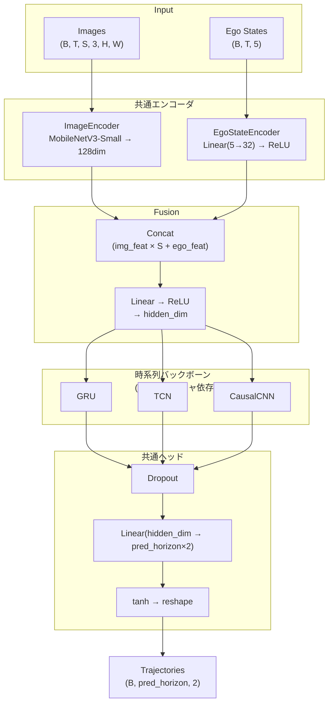
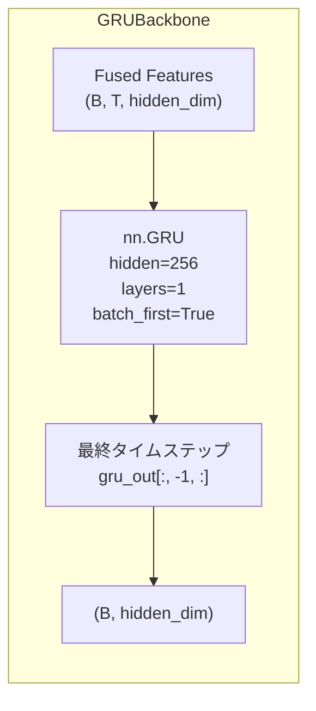
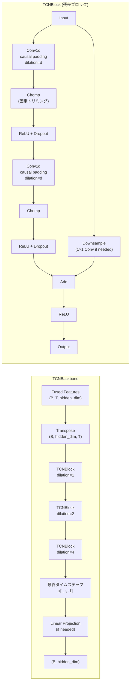
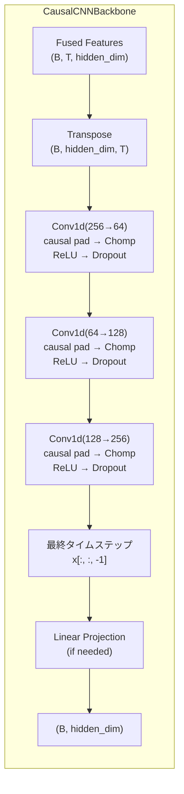
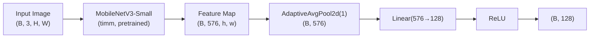

# 仕様書: 時系列モデル (Trajectory Prediction Models)

## 対象リポジトリ
- URL: https://github.com/Romihi/annotation_training_d2j (branch: latest)
- ベースシステム: Donkeycarデータビューア + PyTorch学習ツール (PyQt5 デスクトップアプリ)

---

## 1. 概要

既存の学習機能（単フレームCNNモデル）に加え、**時系列モデルによる軌道予測**をAdvanced Training Featureとして実装。
過去Tフレームの画像・ego_stateを時系列入力とし、将来Nステップの `(steering, throttle)` 軌道を予測する。

3種のアーキテクチャを統一インターフェースで提供:
- **GRU** — Gated Recurrent Unit ベース
- **TCN** — Temporal Convolutional Network（Dilated Causal Conv1D）
- **CausalCNN** — 軽量 Causal Conv1D（TinyLidarNet風）

---

## 2. ファイル一覧と実装状況

| ファイル | 操作 | 状態 | 説明 |
|----------|------|------|------|
| `managers/trajectory_models.py` | 新規 | **実装済** | 全アーキテクチャのモデル定義 |
| `managers/trajectory_dataset.py` | 新規 | **実装済** | 時系列シーケンスDataset |
| `managers/trajectory_training_manager.py` | 新規 | **実装済** | 学習・推論・モデルロード |
| `managers/gru_model.py` | ラッパー | **実装済** | 後方互換エイリアス |
| `managers/gru_dataset.py` | ラッパー | **実装済** | 後方互換エイリアス |
| `managers/gru_training_manager.py` | ラッパー | **実装済** | 後方互換エイリアス |
| `managers/__init__.py` | 追記 | **実装済** | 新旧クラスのexport |
| `managers/mlflow_manager.py` | 追記 | **実装済** | `ModelType.GRU_TRAJECTORY`, `log_gru_trajectory_model()` |
| `config.py` | 追記 | **実装済** | `TRAJ_DEFAULT_*` + 後方互換 `GRU_DEFAULT_*` |
| `translations.py` | 追記 | **実装済** | `traj_*` + 後方互換 `gru_*` 翻訳キー |
| `main.py` | 追記 | **実装済** | UIセクション・学習ダイアログ・推論・結果表示 |

---

## 3. アーキテクチャ全体像

全アーキテクチャは**共通のエンコーダ・ヘッド**を持ち、時系列バックボーンのみが異なるテンプレートメソッドパターンで実装。



### 共通コード: BaseTrajectoryModel

```python
class BaseTrajectoryModel(nn.Module):
    def __init__(self, num_image_sources, ego_dim=5, img_feat_dim=128,
                 ego_feat_dim=32, hidden_dim=256, pred_horizon=10, dropout=0.1):
        # 共通エンコーダ
        self.image_encoder = ImageEncoder(img_feat_dim)
        self.ego_encoder = EgoStateEncoder(ego_dim, ego_feat_dim)
        # Fusion
        fusion_input_dim = img_feat_dim * num_image_sources + ego_feat_dim
        self.fusion = nn.Sequential(nn.Linear(fusion_input_dim, hidden_dim), nn.ReLU())
        # サブクラスで時系列バックボーンを構築
        self._build_temporal(hidden_dim, dropout)
        # 共通ヘッド
        self.head_dropout = nn.Dropout(dropout)
        self.trajectory_head = nn.Linear(hidden_dim, pred_horizon * 2)

    def forward(self, images, ego_states):
        # images: (B, T, S, 3, H, W), ego_states: (B, T, 5)
        # → エンコード → Fusion → 時系列処理 → tanh → (B, pred_horizon, 2)
```

サブクラスは `_build_temporal()` と `_forward_temporal()` の2メソッドのみ実装する。

---

## 4. アーキテクチャ詳細

### 4.1 GRU (Gated Recurrent Unit)



#### 概要

GRU (Gated Recurrent Unit) は LSTM の簡略化版で、リセットゲートと更新ゲートの2つのゲート機構で時系列情報を処理する。LSTMより少ないパラメータで同等の性能を発揮する。

#### 実装コード

```python
class GRUTrajectoryModel(BaseTrajectoryModel):
    ARCH_NAME = "gru"

    def __init__(self, num_image_sources, ..., num_layers=1, ...):
        self._num_layers = num_layers
        self._dropout = dropout
        super().__init__(...)

    def _build_temporal(self, hidden_dim, dropout):
        self.gru = nn.GRU(
            input_size=hidden_dim,
            hidden_size=hidden_dim,
            num_layers=self._num_layers,
            batch_first=True,
            dropout=dropout if self._num_layers > 1 else 0.0
        )

    def _forward_temporal(self, fused):
        gru_out, _ = self.gru(fused)
        return gru_out[:, -1, :]  # 最終タイムステップのみ使用
```

#### 固有パラメータ

| パラメータ | デフォルト | config.py定数 | 説明 |
|-----------|---------|--------------|------|
| `num_layers` | 1 | `TRAJ_GRU_DEFAULT_NUM_LAYERS` | GRUレイヤー数 |

#### 参考文献・リポジトリ

- **論文**: [Learning Phrase Representations using RNN Encoder-Decoder for Statistical Machine Translation](https://arxiv.org/abs/1406.1078) (Cho et al., 2014)
- **PyTorch公式**: [torch.nn.GRU](https://pytorch.org/docs/stable/generated/torch.nn.GRU.html)
- **Donkeycar参考**: [autorope/donkeycar](https://github.com/autorope/donkeycar) — RNNベースパイロット

---

### 4.2 TCN (Temporal Convolutional Network)



#### 概要

TCN (Temporal Convolutional Network) は Dilated Causal Convolution を用いた時系列モデル。指数的に増加するdilation率により、少ない層数で長い受容野を実現する。各ブロックは残差接続を持つ。

- **Causal Convolution**: 未来の情報を使わない一方向畳み込み（パディング→トリミング）
- **Dilated Convolution**: dilation率を `2^i` で増加させ、受容野を指数的に拡大
- **残差接続**: 入出力チャンネル数が異なる場合は 1×1 Conv で次元合わせ

#### 実装コード

```python
class _TCNBlock(nn.Module):
    """残差ブロック（Dilated Causal Conv1D × 2 + 残差接続）"""
    def __init__(self, in_channels, out_channels, kernel_size, dilation, dropout):
        padding = (kernel_size - 1) * dilation
        self.conv1 = nn.Conv1d(in_channels, out_channels, kernel_size,
                               padding=padding, dilation=dilation)
        self.conv2 = nn.Conv1d(out_channels, out_channels, kernel_size,
                               padding=padding, dilation=dilation)
        # Chomp: 因果性を保つために末尾をトリミング
        self.net = nn.Sequential(
            self.conv1, Chomp(padding), ReLU, Dropout,
            self.conv2, Chomp(padding), ReLU, Dropout,
        )
        self.downsample = nn.Conv1d(in_channels, out_channels, 1) \
                          if in_channels != out_channels else None

    def forward(self, x):
        out = self.net(x)
        res = x if self.downsample is None else self.downsample(x)
        return F.relu(out + res)


class TCNTrajectoryModel(BaseTrajectoryModel):
    ARCH_NAME = "tcn"

    def _build_temporal(self, hidden_dim, dropout):
        channels = [hidden_dim] + self._tcn_channels  # e.g. [256, 128, 128, 256]
        layers = []
        for i in range(len(self._tcn_channels)):
            dilation = 2 ** i
            layers.append(_TCNBlock(channels[i], channels[i+1],
                                    self._kernel_size, dilation, dropout))
        self.tcn = nn.Sequential(*layers)
        # 出力次元が hidden_dim と異なる場合のプロジェクション
        tcn_out_dim = self._tcn_channels[-1]
        self.tcn_proj = nn.Linear(tcn_out_dim, hidden_dim) \
                        if tcn_out_dim != hidden_dim else nn.Identity()

    def _forward_temporal(self, fused):
        x = fused.transpose(1, 2)   # (B, T, D) → (B, D, T)
        x = self.tcn(x)
        x = x[:, :, -1]             # 最終タイムステップ
        return self.tcn_proj(x)
```

#### 固有パラメータ

| パラメータ | デフォルト | config.py定数 | 説明 |
|-----------|---------|--------------|------|
| `tcn_channels` | [128, 128, 256] | `TRAJ_TCN_DEFAULT_CHANNELS` | 各ブロックの出力チャンネル数 |
| `kernel_size` | 3 | `TRAJ_TCN_DEFAULT_KERNEL_SIZE` | 畳み込みカーネルサイズ |

#### 受容野の計算

```
受容野 = 1 + Σ (kernel_size - 1) × dilation × 2   (各ブロック2層)
デフォルト (kernel_size=3, 3ブロック):
  = 1 + (2×1×2) + (2×2×2) + (2×4×2) = 1 + 4 + 8 + 16 = 29 タイムステップ
```

seq_len=8 に対して受容野=29なので、入力全体を十分にカバーする。

#### 参考文献・リポジトリ

- **論文**: [An Empirical Evaluation of Generic Convolutional and Recurrent Networks for Sequence Modeling](https://arxiv.org/abs/1803.01271) (Bai et al., 2018)
- **公式実装**: [locuslab/TCN](https://github.com/locuslab/TCN)
- **解説**: [TCN Architecture Paper Review](https://paperswithcode.com/method/tcn)

---

### 4.3 CausalCNN (TinyLidarNet風)



#### 概要

CausalCNN は TinyLidarNet のアイデアに基づく軽量な因果畳み込みネットワーク。TCNとは異なり、残差接続やdilation拡大を使わないシンプルな構成で、パラメータ数を抑えつつ時系列処理を行う。

- **因果畳み込み**: 各Conv1dにcausal paddingを適用し、Chompで末尾をトリミング
- **残差接続なし**: TCNより単純でパラメータ数が少ない
- **チャンネル削減→拡大**: 256→64→128→256 のボトルネック構造

#### 実装コード

```python
class CausalCNNTrajectoryModel(BaseTrajectoryModel):
    ARCH_NAME = "causal_cnn"

    def _build_temporal(self, hidden_dim, dropout):
        channels = [hidden_dim] + self._cnn_channels  # [256, 64, 128, 256]
        layers = []
        for i in range(len(self._cnn_channels)):
            padding = self._kernel_size - 1  # causal padding (dilation=1)
            layers.extend([
                nn.Conv1d(channels[i], channels[i+1], self._kernel_size, padding=padding),
                _CausalChomp(padding),
                nn.ReLU(inplace=True),
                nn.Dropout(dropout),
            ])
        self.cnn = nn.Sequential(*layers)
        cnn_out_dim = self._cnn_channels[-1]
        self.cnn_proj = nn.Linear(cnn_out_dim, hidden_dim) \
                        if cnn_out_dim != hidden_dim else nn.Identity()

    def _forward_temporal(self, fused):
        x = fused.transpose(1, 2)   # (B, T, D) → (B, D, T)
        x = self.cnn(x)
        x = x[:, :, -1]             # 最終タイムステップ
        return self.cnn_proj(x)
```

#### 固有パラメータ

| パラメータ | デフォルト | config.py定数 | 説明 |
|-----------|---------|--------------|------|
| `cnn_channels` | [64, 128, 256] | `TRAJ_CAUSAL_CNN_DEFAULT_CHANNELS` | 各層の出力チャンネル数 |
| `kernel_size` | 3 | `TRAJ_CAUSAL_CNN_DEFAULT_KERNEL_SIZE` | 畳み込みカーネルサイズ |

#### 参考文献・リポジトリ

- **TinyLidarNet**: [CPR-D/TinyLidarNet](https://github.com/CPR-D/TinyLidarNet) — Jetson向け軽量時系列モデル
- **論文**: [WaveNet: A Generative Model for Raw Audio](https://arxiv.org/abs/1609.03499) (van den Oord et al., 2016) — Causal Convolutionの原典
- **Donkeycar応用**: [autorope/donkeycar](https://github.com/autorope/donkeycar) — 軽量モデルの設計思想

---

## 5. 共通エンコーダ

### 5.1 ImageEncoder



```python
class ImageEncoder(nn.Module):
    def __init__(self, feat_dim=128):
        self.backbone = timm.create_model('mobilenetv3_small_100', pretrained=True, num_classes=0)
        backbone_out = self.backbone.num_features  # 576
        self.pool = nn.AdaptiveAvgPool2d(1)
        self.fc = nn.Linear(backbone_out, feat_dim)
        self.relu = nn.ReLU(inplace=True)

    def forward(self, x):
        features = self.backbone.forward_features(x)  # (B, 576, h, w)
        features = self.pool(features).flatten(1)      # (B, 576)
        return self.relu(self.fc(features))             # (B, 128)
```

- **バックボーン**: `timm` の `mobilenetv3_small_100`（ImageNet事前学習済み）
- **全画像ソース共通**: 複数ソースの画像は同一エンコーダで処理（weight sharing）
- **出力**: 128次元の特徴ベクトル

#### 参考文献

- **MobileNetV3**: [Searching for MobileNetV3](https://arxiv.org/abs/1905.02244) (Howard et al., 2019)
- **timm**: [huggingface/pytorch-image-models](https://github.com/huggingface/pytorch-image-models)

### 5.2 EgoStateEncoder

```python
class EgoStateEncoder(nn.Module):
    def __init__(self, ego_dim=5, feat_dim=32):
        self.fc = nn.Linear(ego_dim, feat_dim)
        self.relu = nn.ReLU(inplace=True)

    def forward(self, x):
        return self.relu(self.fc(x))  # (B, 5) → (B, 32)
```

| フィールド | アノテーションキー | 型 | 範囲 |
|-----------|-------------------|-----|------|
| steering | `angle` | float | -1.0 〜 1.0 |
| throttle | `throttle` | float | -1.0 〜 1.0 |
| vx | `speed` | float | m/s |
| vy | (未使用) | float | 常に0.0 |
| omega | (未使用) | float | 常に0.0 |

---

## 6. ファクトリ関数

```python
TRAJECTORY_ARCHITECTURES = {
    "gru": GRUTrajectoryModel,
    "tcn": TCNTrajectoryModel,
    "causal_cnn": CausalCNNTrajectoryModel,
}

def create_trajectory_model(model_arch, num_image_sources, config):
    """アーキテクチャ名からモデルを生成"""
    common = dict(
        num_image_sources=num_image_sources,
        hidden_dim=config.get('hidden_dim', 256),
        pred_horizon=config.get('pred_horizon', 10),
        dropout=config.get('dropout', 0.1),
    )
    if model_arch == "gru":
        return GRUTrajectoryModel(**common, num_layers=config.get('num_layers', 1))
    elif model_arch == "tcn":
        return TCNTrajectoryModel(**common,
            tcn_channels=config.get('tcn_channels', [128, 128, 256]),
            kernel_size=config.get('kernel_size', 3))
    elif model_arch == "causal_cnn":
        return CausalCNNTrajectoryModel(**common,
            cnn_channels=config.get('cnn_channels', [64, 128, 256]),
            kernel_size=config.get('kernel_size', 3))
```

---

## 7. データセット (`managers/trajectory_dataset.py`)

### 7.1 TrajectorySequenceDataset

```python
class TrajectorySequenceDataset(Dataset):
    def __init__(self, valid_indexes, annotations, images,
                 source_images_map, selected_sources,
                 seq_len=8, pred_horizon=10, stride=1,
                 img_size=(128, 128), augment=False)
```

### 7.2 セッション境界検出

```python
def _detect_session_boundaries(self) -> List[List[int]]:
    # valid_indexes内のインデックスギャップ（差分>1）でセッション区切りを判定
    # 連続するインデックスを同一セッションとしてグループ化
```

### 7.3 シーケンス構築ルール

```
input_indexes  = session[i : i + seq_len]          # 過去Tフレーム
target_indexes = session[i + seq_len : i + total]   # 将来Nフレーム
```

- セッションをまたぐシーケンスは生成しない
- 削除インデックスは `valid_indexes` 構築時に除外済み

### 7.4 データ拡張

- **水平フリップ**: 50%の確率で画像を水平反転 + steering符号反転
- `augment=True` は学習時のみ。Validation / Prediction 時は常にFalse

### 7.5 画像前処理

```python
transforms.Compose([
    transforms.Resize(img_size),          # (128, 128)
    transforms.ToTensor(),                # [0, 1] float32
    transforms.Normalize(                 # ImageNet正規化
        mean=[0.485, 0.456, 0.406],
        std=[0.229, 0.224, 0.225])
])
```

---

## 8. 学習マネージャー (`managers/trajectory_training_manager.py`)

### 8.1 TrajectoryTrainingManager

```python
class TrajectoryTrainingManager:
    def __init__(self, models_dir, mlflow_manager=None)
    def train(self, valid_indexes, annotations, images,
              source_images_map, selected_sources, config,
              progress_callback=None) -> dict
    def predict(self, model_path, valid_indexes, annotations, images,
                source_images_map, progress_callback=None) -> dict
    @staticmethod
    def load_model(model_path, device=None) -> tuple
    def _save_model(...) -> str
    @staticmethod
    def _format_time(seconds) -> str
```

### 8.2 train() の動作

1. `TrajectorySequenceDataset` を構築
2. `random_split` で Train/Val 分割（デフォルト 80:20）
3. Val用に `augment=False` の別Datasetを作成し、同じインデックスで `Subset` 構築
4. `create_trajectory_model()` でモデルをインスタンス化
5. `Adam` (weight_decay=1e-4) + `ReduceLROnPlateau` (factor=0.5, patience=5)
6. 損失: `nn.MSELoss()`, 勾配クリッピング: `clip_grad_norm_(max_norm=1.0)`
7. Best Val Loss のモデルを追跡・保存
8. キャンセル時もベストモデルを保存
9. 学習曲線グラフを自動保存（`*_training_curve.png`）
10. MLflow ログ（`mlflow_manager` がある場合）

### 8.3 進捗メッセージ形式

自動運転モデルと統一された形式:

```
[GRU] エポック 5/50 完了
学習損失: 0.023456
検証損失: 0.034567 (Best: 0.030000)
経過時間: 2分00秒 | 残り時間: 9分00秒 | 終了予定: 14:35:00
```

### 8.4 predict() の動作

1. `load_model()` でチェックポイントからモデル復元
2. チェックポイントに保存された `selected_sources`, `seq_len`, `pred_horizon` を使用
3. `TrajectorySequenceDataset` を構築（stride=1, augment=False）
4. バッチ推論を実行
5. 各シーケンスの**最終入力フレームインデックス**をキーとして予測を格納
6. 結果: `predictions[frame_index] = [[s0,t0], [s1,t1], ..., [sN,tN]]`

### 8.5 load_model() — 後方互換対応

```python
@staticmethod
def load_model(model_path, device=None):
    checkpoint = torch.load(model_path, ...)
    model_type = checkpoint.get('model_type', '')
    if model_type == 'gru_trajectory':      # 旧フォーマット
        cfg.setdefault('model_arch', 'gru')
        cfg.setdefault('hidden_dim', cfg.pop('gru_hidden', 256))
        cfg.setdefault('num_layers', cfg.pop('gru_layers', 1))
    elif model_type == 'trajectory':         # 新フォーマット
        model_arch = checkpoint.get('model_arch', 'gru')
    model = create_trajectory_model(model_arch, cfg['num_image_sources'], cfg)
    model.load_state_dict(checkpoint['model_state_dict'])
    return model, cfg, checkpoint.get('selected_sources', [])
```

### 8.6 モデル保存形式

ファイル名: `models/traj_{arch}_{timestamp}_{seq_len}s_{pred_horizon}h.pth`

```python
{
    "model_state_dict": OrderedDict,
    "model_type": "trajectory",
    "model_arch": "gru" | "tcn" | "causal_cnn",
    "config": {
        "num_image_sources": int,
        "model_arch": str,
        "seq_len": int,
        "pred_horizon": int,
        "hidden_dim": int,
        "dropout": float,
        "img_size": tuple,
        # アーキテクチャ固有:
        "num_layers": int,           # GRU
        "tcn_channels": list,        # TCN
        "kernel_size": int,          # TCN / CausalCNN
        "cnn_channels": list,        # CausalCNN
    },
    "selected_sources": List[str],
    "train_losses": List[float],
    "val_losses": List[float],
    "epochs_trained": int,
    "created_at": "ISO8601"
}
```

---

## 9. config.py 定数

```python
# 時系列モデル共通
TRAJ_DEFAULT_SEQ_LEN = 8
TRAJ_DEFAULT_PRED_HORIZON = 10
TRAJ_DEFAULT_STRIDE = 1
TRAJ_DEFAULT_HIDDEN_DIM = 256
TRAJ_DEFAULT_DROPOUT = 0.1
TRAJ_DEFAULT_IMG_SIZE = (128, 128)
TRAJ_DEFAULT_EPOCHS = 50
TRAJ_DEFAULT_BATCH_SIZE = 32

# GRU固有
TRAJ_GRU_DEFAULT_NUM_LAYERS = 1

# TCN固有
TRAJ_TCN_DEFAULT_CHANNELS = [128, 128, 256]
TRAJ_TCN_DEFAULT_KERNEL_SIZE = 3

# CausalCNN固有
TRAJ_CAUSAL_CNN_DEFAULT_CHANNELS = [64, 128, 256]
TRAJ_CAUSAL_CNN_DEFAULT_KERNEL_SIZE = 3

# 後方互換エイリアス
GRU_DEFAULT_SEQ_LEN = TRAJ_DEFAULT_SEQ_LEN
GRU_DEFAULT_PRED_HORIZON = TRAJ_DEFAULT_PRED_HORIZON
# ... (他のエイリアスも同様)
```

---

## 10. UI統合 (`main.py`)

### 10.1 UIセクション配置

左パネル内、自動運転モデルの直下に配置:

```
自動運転モデル        (既存)
時系列モデル          [開発中] [▶]   ← 折りたたみ式
物体検知              (既存)
位置推論モデル        (既存)
ウェイポイントモデル  (既存)
```

### 10.2 時系列セクション展開時の構成

```
時系列モデル  [開発中]  [▼]
├── アーキテクチャ: [GRU ▼] [TCN] [CausalCNN] [すべて]
├── モデルファイル: [traj_gru_20260308_... ▼]
├── [学習・保存] [推論実行]    ← ボタン
└── ☐ 時系列予測軌道を表示    ← チェックボックス
```

### 10.3 学習設定ダイアログ（2カラムレイアウト）

```
┌──────────────────────────────────────────────────────────────┐
│ 時系列モデル - 学習設定                      [min-width=1000]│
├─────────────────────────┬────────────────────────────────────┤
│ [左カラム]              │ [右カラム]                          │
│                         │                                    │
│ ┌─アーキテクチャ設定──┐ │ ┌─学習パラメータ──────────────────┐ │
│ │ モデル: [GRU ▼]     │ │ │ Epochs: [50] 学習率: [0.001 ▼] │ │
│ │ SeqLen:[8] Pred:[10]│ │ │ Batch: [32▼] Val割合: [0.20]   │ │
│ │ Stride:[1]          │ │ │ ☐ データ拡張                    │ │
│ │ Hidden:[256▼] DO:   │ │ └────────────────────────────────┘ │
│ │ [0.10]              │ │                                    │
│ │ GRU Layers:[1]      │ │ ┌─学習対象データ選択──────────────┐ │
│ │ 入力:8F→予測:10F    │ │ │ ○ 全アノテーション使用          │ │
│ └─────────────────────┘ │ │ ○ スキップ使用 [5]             │ │
│                         │ │ ○ インデックス範囲 [0]〜[999]  │ │
│ ┌─画像ソース選択──────┐ │ │ 有効データ: 800/1000枚         │ │
│ │ ☑ cam              │ │ └────────────────────────────────┘ │
│ │ ☐ cam2             │ │                                    │
│ │ 1 ソース選択中      │ │                                    │
│ └─────────────────────┘ │                                    │
├─────────────────────────┴────────────────────────────────────┤
│                              [学習開始] [キャンセル]          │
└──────────────────────────────────────────────────────────────┘
```

### 10.4 推論結果の表示

#### 情報パネル表示

```html
<b style="color:#00C800">時系列推論結果(a,t)：</b>
<table>
  <tr><td>t+1: </td><td style="color:#00C800">+0.123, </td><td style="color:#008000">+0.456</td></tr>
  <tr><td>t+2: </td><td style="color:#00C800">+0.134, </td><td style="color:#008000">+0.445</td></tr>
  ...
</table>
```

- `t+N:` — 黒色（デフォルト）
- angle値 — `#00C800`（明るい緑）
- throttle値 — `#008000`（暗い緑）

#### 画像オーバーレイ（ImageLabel paintEvent）

- **中実三角**: 進行方向を向く三角形、t+1が最大サイズ（ANNOTATION_CIRCLE_SIZE - 1）で段階的に縮小
- **矢印接続**: t+1 → t+2 → ... の方向に矢印付き線で接続
- **色**: `QColor(0, 200, 0)` (緑), 枠線 `QColor(0, 128, 0)` (濃い緑)
- **座標変換**: `x = (steering + 1) / 2 * img_width`, `y = (1 - throttle) / 2 * img_height`

---

## 11. 後方互換

旧GRU専用コードからの移行を保証:

| 旧 | 新 | 対応 |
|----|-----|------|
| `managers/gru_model.py` | `managers/trajectory_models.py` | 薄いラッパーでre-export |
| `managers/gru_dataset.py` | `managers/trajectory_dataset.py` | `GRUSequenceDataset = TrajectorySequenceDataset` |
| `managers/gru_training_manager.py` | `managers/trajectory_training_manager.py` | `GRUTrainingManager = TrajectoryTrainingManager` |
| `model_type: "gru_trajectory"` | `model_type: "trajectory"` | `load_model()` で両方対応 |
| `GRU_DEFAULT_*` | `TRAJ_DEFAULT_*` | config.pyにエイリアス定義 |
| `gru_*` 翻訳キー | `traj_*` 翻訳キー | translations.pyに両方定義 |

---

## 12. アーキテクチャ比較

| 特性 | GRU | TCN | CausalCNN |
|------|-----|-----|-----------|
| 時系列処理 | リカレント | Dilated畳み込み | 通常畳み込み |
| 並列計算 | 不可（逐次） | 可能 | 可能 |
| 受容野 | 無限（理論上） | 指数的拡大 | 線形拡大 |
| 残差接続 | なし | あり | なし |
| パラメータ数 | 中 | 多 | 少 |
| 推論速度 | 遅 | 速 | 最速 |
| 長期依存性 | 良 | 良 | 限定的 |
| 適用場面 | 汎用 | 長いシーケンス | 短いシーケンス・エッジデバイス |

---

## 13. ディレクトリ構成

```
annotation_training_d2j/
├── managers/
│   ├── __init__.py                      ← 新旧クラスexport
│   ├── trajectory_models.py             ← 全アーキテクチャのモデル定義
│   ├── trajectory_dataset.py            ← シーケンスDataset
│   ├── trajectory_training_manager.py   ← 学習・推論・モデルロード
│   ├── gru_model.py                     ← 後方互換ラッパー
│   ├── gru_dataset.py                   ← 後方互換ラッパー
│   ├── gru_training_manager.py          ← 後方互換ラッパー
│   └── mlflow_manager.py               ← GRU_TRAJECTORY追加
├── main.py                              ← UIセクション・ダイアログ・表示
├── config.py                            ← TRAJ_DEFAULT_* + GRU_DEFAULT_*
├── translations.py                      ← traj_* + gru_* 翻訳キー
├── dev/
│   └── SPEC_trajectory_models.md        ← THIS FILE
└── models/                              ← モデル保存先 (traj_*.pth)
```

---

## 14. 依存ライブラリ

```
torch>=2.0
torchvision>=0.15
timm>=1.0.14          # MobileNetV3-Small バックボーン
numpy
Pillow
mlflow                # 実験管理（オプション）
matplotlib            # 学習曲線プロット
```
